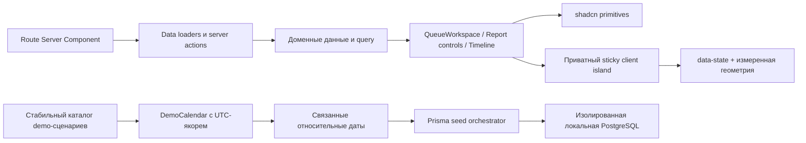

# Восстановление интерфейса после миграции на shadcn/ui

Дата: 2026-07-27

Статус: согласованное направление, спецификация на ревью

Проект: `apps/web`

## Контекст

Проект переведён на shadcn/ui с Base UI, стилем `base-nova`, Tailwind CSS v4 и
Lucide. `apps/web/src/app/layout.tsx` импортирует только
`apps/web/src/app/globals.css`; прежние `styles/components/*` и `theme.css`
намеренно исключены из layout. Возвращать их целиком нельзя: это восстановит
параллельную дизайн-систему и снова сделает внешний вид зависимым от порядка
импортов.

Аудит охватил 26 маршрутов, DOM и вычисленные стили на ключевых экранах,
статический поиск по компонентам, unit-, typecheck- и e2e-базу, а также
демонстрационную PostgreSQL-базу, развёрнутую отдельно от рабочей. Главный вывод:
базовые shadcn-примитивы и `PageShell` работают, но несколько продуктовых модулей
сохранили старые BEM-классы как единственный источник геометрии. После удаления
legacy CSS эти классы остались в разметке, но перестали что-либо оформлять.

Зафиксированные симптомы:

- `/reviews`: KPI, липкая панель, список и предпросмотр идут вертикальными
  блоками; страница растягивается примерно до 4 000 px.
- `/reviews/:id`: строки таймлайна, аватары, заголовки и пузырьки сообщений
  теряют сетку и визуальную иерархию.
- `/reports`: строка выбора периода может схлопнуться до нулевой ширины из-за
  сочетания `FieldGroup` с `w-full shrink-0` и горизонтального flex-контейнера.
- `TrendChart` и `InteractiveSparklineChart` рассчитывают точки, но их видимые
  stroke, fill, размеры, hit-layer и tooltip всё ещё заданы только в выключенном
  CSS.
- верхняя навигация имеет внутренний горизонтальный overflow: в измеренном
  состоянии доступно около 399 px при содержимом около 617 px.
- детальная страница интеграции содержит слишком узкие вложенные карточки и
  неестественные переносы слов.
- в 16 TSX-файлах осталось 68 продуктовых legacy-токенов, часть из которых
  продолжает быть скрытым layout-контрактом.
- текущие e2e-тесты часто проверяют удалённые классы и старый текст, но не
  фактическую геометрию. Из полного прогона прошли 2 сценария из 13; значительная
  часть 11 падений относится к устаревшим test seams.

Демо-данные также не отражают текущий момент: финализированные проверки
заканчиваются 26 мая 2026 года, открытые задания на обучение просрочены с мая,
а текущие отчётные периоды 22-е–21-е и текущая неделя пусты. Из-за этого
исправленные графики и рабочие состояния нельзя надёжно оценить визуально.

## Цели

1. Восстановить правильную геометрию всех обнаруженных проблемных экранов без
   возврата legacy CSS.
2. Закрепить layout внутри глубоких продуктовых компонентов, чтобы вызывающий
   код не передавал магические классы, ширины и sticky-offset.
3. Оставить стандартные контролы исключительно на shadcn/ui и Base UI.
4. Сохранить текущую русскую информационную архитектуру, тексты действий,
   имена полей форм, href, server actions и права доступа.
5. Сделать демонстрационный сценарий актуальным относительно даты запуска seed,
   детерминированным в тестах и насыщенным всеми важными состояниями продукта.
6. Перенести регрессионную защиту с CSS-селекторов на доступные роли, стабильные
   `data-slot` и измеряемую геометрию.
7. Проверить светлую и тёмную темы на 390, 768, 1280 и 1440 px.

## Не входит в работу

- возврат `theme.css` или `styles/components/*` в глобальный layout;
- смена продуктовой навигации, терминологии или бизнес-процессов;
- новая функциональность backend, новые интеграции или изменение схемы БД;
- массовый косметический редизайн исправных страниц;
- обновление Next.js, React, Tailwind, shadcn/ui или Base UI;
- исправление несвязанных изменений в текущем незакоммиченном worktree.

## Ограничения дизайн-системы

- Стандартные элементы интерфейса собираются из `@/components/ui/*`.
- Для Base UI используется `render`, а не `asChild`; формы с `FormData`
  предпочитают `NativeSelect`.
- Геометрия описывается Tailwind v4 рядом с компонентом. Цвета используют только
  семантические токены: `bg-background`, `bg-card`, `border-border`,
  `text-foreground`, `text-muted-foreground`, `bg-muted` и их прозрачные
  варианты.
- `PageShell`, `Card`, `Button`, `Badge`, `Table`, `Field`, `NativeSelect`,
  `Pagination` и остальные исправные примитивы сохраняются и не дублируются.
- Горизонтальный overflow допускается только внутри конкретного владельца
  широкого содержимого, например `[data-slot="table-container"]`. Прятать
  overflow на `body` или корне страницы запрещено.
- У каждого grid/flex-потомка, который может сжиматься, явно обеспечивается
  `min-w-0`.

## Архитектурное решение

### 1. Очередь проверок как глубокий продуктовый модуль

Три параллельных варианта интерфейса сошлись на одном принципе: очередь должна
сама владеть сеткой, responsive-переходами и sticky-поведением. Выбран
композиционный вариант средней глубины. Он не превращает компонент в
универсальный layout-конструктор, но оставляет загрузку данных и бизнес-решения
на серверной странице.

Публичный интерфейс:

```tsx
type QueueWorkspaceProps =
  Omit<React.ComponentProps<typeof PageShell>, "children" | "className"> & {
    children: React.ReactNode;
  };

type QueueWorkspaceKpisProps = {
  "aria-label": string;
  children: React.ReactNode;
};

type QueueWorkspaceCommandBarProps = {
  "aria-label": string;
  children: React.ReactNode;
  expandedOnly?: React.ReactNode;
  stuckOnly?: React.ReactNode;
};

type QueueWorkspaceMainProps = {
  "aria-label": string;
  children: React.ReactNode;
  preview?: React.ReactNode;
  previewLabel?: string;
};

export const QueueWorkspace = Object.assign(QueueWorkspaceRoot, {
  Kpis: QueueWorkspaceKpis,
  CommandBar: QueueWorkspaceCommandBar,
  Main: QueueWorkspaceMain
});
```

Интерфейс намеренно не принимает `className`, breakpoint, ширину колонок,
sticky-offset или порядок DOM. Разовые вариации не могут размыть инварианты
layout. Если в будущем появится вторая реальная очередь с другим поведением,
она получит отдельный адаптер или семантический вариант.

`QueueWorkspace.Root` остаётся server-safe и оборачивает существующий
`PageShell`. Серверная страница продолжает:

- получать `getReviewQueuePageData`;
- вычислять бизнес-сводку, focus items, preview и pagination href;
- связывать `takeNextReview`;
- передавать русские тексты и существующие доменные компоненты.

`QueueWorkspace` владеет только представлением этих частей и не переносит
репозиторий данных, server actions или парсинг query внутрь UI-модуля. Так
очередь получает один источник геометрии, но не становится монолитом из data,
actions и markup.

Responsive-контракт:

- 390 px: одна KPI-карточка в строке, затем одноколоночная рабочая область;
- 768 px: две KPI-карточки в строке, рабочая область остаётся одноколоночной;
- 1280 и 1440 px: четыре KPI в строке, список и preview располагаются рядом по
  схеме `minmax(0, 1fr) minmax(18rem, 22rem)`;
- preview идёт после списка в DOM, статичен в узкой версии и липнет ниже topbar
  только в двухколоночном режиме;
- широкая таблица прокручивается внутри shadcn-контейнера, не расширяя документ.

Стабильный тестовый DOM-контракт задаётся `data-slot`, а не именами Tailwind или
BEM-классами:

```text
review-queue-workspace
review-queue-kpis
review-queue-command-slot
review-queue-command-bar
review-queue-list
review-queue-preview
```

### 2. Липкая панель без внешнего CSS-протокола

Существующий `StickyCommandBarShell` требует от вызывающего кода магический
`className`, а затем создаёт `${className}__slot` и `${className}--stuck`.
Этот протокол удаляется.

Приватный client island внутри `QueueWorkspace.CommandBar`:

- измеряет естественную высоту панели через `ResizeObserver`;
- оставляет в потоке slot той же высоты;
- при фиксации измеряет `left` и `width` собственного slot, поэтому не знает
  ширину sidebar;
- использует `data-state="resting|stuck"` как единственное внешне наблюдаемое
  состояние;
- на узких экранах всегда остаётся в потоке;
- имеет fallback без `ResizeObserver`: панель остаётся usable и не вызывает
  layout jump;
- сбрасывает измерения при resize и после изменения высоты saved/quick views;
- использует `requestAnimationFrame` и гистерезис, чтобы не дрожать на границе.

`expandedOnly` содержит быстрые/сохранённые виды, `stuckOnly` — компактную
сводку. Одни и те же фильтры остаются в DOM в обоих состояниях, поэтому значения
формы и фокус не теряются.

### 3. Таймлайн диалога

`ConversationTimeline` становится владельцем всей геометрии сообщения:

- `article` — grid с фиксированным аватаром и `minmax(0, 1fr)` для контента;
- аватар имеет стабильный размер 32 px, круг, центрирование и семантический
  цвет по `data-party`;
- header — flex-wrap с автором, ролью, badge, временем и действиями;
- клиентское сообщение остаётся спокойным текстовым блоком, ответ агента —
  читаемым пузырьком ограниченной ширины;
- длинные слова и ссылки безопасно переносятся через `break-words`, но обычные
  русские слова не дробятся;
- заметки коучинга, доказательства, приватность и действия сохраняют текущие
  server actions и ARIA.

Старые `conversation-message__*` могут временно оставаться только как
поведенческие или миграционные маркеры, если на них ещё есть явный потребитель.
После переноса тестов и отсутствия потребителей они удаляются. Ни один из них не
может оставаться единственным источником layout или цвета.

`MasterDetail` продолжает владеть базовой responsive-сеткой. У страницы
`/reviews/:id` удаляется внешний `review-workbench__panes`, который сейчас
перекрывает его геометрию. Доменный переключатель панелей сохраняется, но
реализуется через явный `data-active-pane` и Tailwind-варианты внутри владельца.

### 4. Отчёты: контролы и графики

`ReportPeriodControls` получает собственный responsive layout:

- на 390 px поля идут вертикально и занимают доступную ширину;
- с 768 px поля могут идти в строку;
- flex-контейнер получает `min-w-0`, а отдельные `FieldGroup` —
  `w-full min-w-0 sm:w-auto sm:flex-1`, без конкурирующего `shrink-0`;
- select и кнопки имеют читаемую минимальную ширину, но не расширяют документ.

`TrendChart` и `InteractiveSparklineChart` перестают зависеть от выключенного
CSS. Размеры SVG, stroke, fill, axis, hit targets, focus-ring и tooltip
описываются в самих компонентах через Tailwind utilities, SVG attributes и
семантические CSS variables из темы. Математика построения точек и существующие
публичные props не меняются.

Для пустой или недостаточной серии выводится явное русское empty state. При
наличии данных:

- линия, столбцы и точки видимы в светлой и тёмной теме;
- последняя и активная точка различимы не только цветом;
- tooltip доступен по hover и keyboard focus;
- SVG имеет доступное имя, а декоративные оси скрыты от screen reader;
- chart не полагается на тестовый поиск по `.trend-chart__line`.

### 5. Адаптивная верхняя навигация

Вместо постоянного горизонтального скролла вводится приоритетное раскрытие:

- до `md` остаётся существующее меню разделов;
- на среднем desktop отображаются иконка и активный раздел, остальные разделы
  доступны из меню «Разделы»;
- на широком desktop показываются все разделы, если они помещаются;
- поиск, основное действие и меню пользователя сохраняют доступ и не
  выталкиваются за край;
- «Рабочий пульс» сворачивает подписи раньше числовых badge;
- ни один desktop-режим не имеет постоянно видимой горизонтальной полосы
  прокрутки.

Решение опирается на существующие `areas`, `activeAreaId`, `DropdownMenu`,
`Button`, `Badge` и Lucide, не создаёт новую навигационную модель и не дублирует
список маршрутов.

### 6. Плотные административные и интеграционные экраны

Исправления ограничиваются владельцами layout:

- вложенные карточки заменяются на секции внутри одной карточки там, где
  вложенность не несёт отдельного интерактивного контекста;
- label/value пары получают grid `minmax(0, …)` и `min-w-0`;
- идентификаторы, URL и технические значения используют `break-all` только
  локально; обычный текст использует `break-words`;
- статусы вроде «Импортировано» не дробятся на искусственные строки;
- кнопки и поля форм сохраняют текущие имена, действия и shadcn-примитивы.

Это не новый визуальный стиль, а восстановление плотности, ритма и читаемости
уже выбранного `base-nova`.

## Динамический календарь демо-данных

### Модель времени

Содержимое демо-сценария описывается относительно одного UTC-якоря.

```ts
type DemoCalendar = Readonly<{
  now: Date;
  startOfToday: Date;
  startOfWeek: Date;
  currentVkPeriod: ReportPeriod;
  previousVkPeriod: ReportPeriod;
  currentMonth: ReportPeriod;
  previousMonth: ReportPeriod;
}>;

export function createDemoCalendar(now: Date): DemoCalendar;
export function resolveDemoSeedNow(env: NodeJS.ProcessEnv): Date;
```

`resolveDemoSeedNow` использует `DEMO_SEED_NOW`, если переменная задана, иначе
текущий момент. Значение нормализуется в UTC. Невалидная дата завершает seed до
первой записи с понятной ошибкой. В тестах всегда передаётся фиксированный
якорь, поэтому snapshot и диапазоны детерминированы.

Существующий `assertSeedAllowed` выполняется до построения данных и остаётся
обязательным. Изменение схемы БД не требуется.

### Разделение каталога и календаря

Большой `prisma/seed.ts` не должен продолжать смешивать бизнес-каталог и сотни
литеральных дат. Он разделяется без изменения итоговой предметной модели:

1. **Каталог сценариев** хранит стабильные ID, имена, источники, тексты
   диалогов, оценки, причины, риски и связи.
2. **Календарный адаптер** переводит семантические смещения
   (`daysAgo(2)`, `inDays(3)`, `atPeriodDay("current", 8)`) в `Date`.
3. **Seed orchestrator** применяет каталог к Prisma в существующем порядке.

В сценариях запрещены новые фиксированные календарные даты, кроме явно
документированных исторических метаданных, не участвующих в UI-фильтрах.
Связанные события строятся от одного основания:

`openedAt <= closedAt <= finalizedAt <= now`, а due date и последующие действия
получают семантические смещения. Финализированные проверки не создаются в
будущем.

### Покрытие состояний

После каждого seed интерфейс должен содержать:

- финализированные проверки и findings и в текущем, и в предыдущем периоде
  22-е–21-е, чтобы сравнение отчётов было непустым;
- ненулевые события текущей недели для dashboard;
- очередь со статусами `QUEUED`, `ASSIGNED`, `IN_PROGRESS`, `REOPENED` и смесью
  SLA: просрочено, сегодня, скоро, в срок;
- завершённые проверки с различными score, risk, critical error, reanswer,
  appeal, feedback, CSAT и sampling type;
- задания на обучение `open`, `in_progress`, `done` с датами в прошлом, сегодня
  и будущем;
- калибровки `draft`, `active`, `completed`, `archived` вокруг якоря;
- свежие integration runs, jobs, sync snapshots и ошибки разных уровней;
- не менее 6 источников, 4 агентов, 3 команд, 8 категорий findings и всех
  поддерживаемых уровней риска;
- достаточно точек во временных рядах, чтобы line, bar, target band, active point
  и tooltip были видимы.

Seed-инварианты проверяют диапазоны до обращения к Prisma. После заполнения
отдельной локальной БД smoke-проверка подтверждает минимальные количества в
обоих отчётных периодах, текущей неделе и операционных статусах.

## Поток данных



Server Components остаются источником данных и бизнес-решений. Клиентский код
добавляется только там, где необходимы измерения, фокус или интерактивный
tooltip. Демо-календарь — чистая логика; Prisma отвечает только за запись уже
валидированного сценария.

## Обработка ошибок и пограничные состояния

- Невалидный `DEMO_SEED_NOW` останавливает seed до mutation.
- Нарушение порядка дат или выход финализации в будущее показывает ID сценария
  и конкретный инвариант.
- Пустые отчёты и серии графиков показывают явное состояние, а не невидимый SVG.
- При отсутствии `ResizeObserver` sticky-панель остаётся в нормальном потоке.
- При отсутствии preview `QueueWorkspace.Main` становится одноколоночным без
  пустой второй колонки.
- Очень длинные source ID, email и URL переносятся только в своём контейнере.
- Длинные русские подписи не уменьшают form control до нулевой ширины.
- Base UI control не переключается между controlled и uncontrolled режимом
  после гидрации; предупреждение `FieldControl` закрывается отдельным
  регрессионным тестом.

## Стратегия тестирования

Работа ведётся через TDD: для каждого найденного дефекта сначала добавляется
падающий тест, который воспроизводит наблюдаемую поломку, затем минимальное
исправление и только после зелёного теста — рефакторинг.

### Unit и contract

- `QueueWorkspace` проверяется по русским ролям/именам и стабильным `data-slot`.
- Sticky state проверяет сохранение высоты slot и переход
  `resting → stuck → resting`.
- `createDemoCalendar` и преобразователи смещений проверяются на границах месяца,
  года, недели и периода 22-е–21-е.
- Seed scenario validator проверяет порядок дат, запрет будущих финализаций и
  минимальное покрытие состояний.
- Графики проверяются через доступные роли и SVG attributes: ненулевые размеры,
  stroke/fill, количество точек, focusable hit targets и tooltip.
- Report controls проверяются на отсутствие `w-full shrink-0` у дочернего
  `FieldGroup` в горизонтальном режиме.
- Статический contract-test запрещает использование подтверждённых retired
  layout-классов как единственного styling seam. Поведенческие классы удаляются
  только после проверки всех потребителей.

### E2E и измеряемая геометрия

На 390, 768, 1280 и 1440 px проверяются:

- `scrollWidth - clientWidth <= 2px` у документа;
- KPI-сетка: 1 / 2 / 4 / 4 колонки;
- list и preview находятся друг под другом на 390/768 и рядом на 1280/1440;
- таблица прокручивается локально, не увеличивая ширину документа;
- после scroll command bar имеет `data-state="stuck"`, `position: fixed`,
  остаётся внутри границ workspace, а slot сохраняет исходную высоту;
- многократное переключение saved view не накапливает высоту страницы;
- avatar и content таймлайна занимают разные grid-колонки, header не наезжает на
  toolbar, длинное сообщение остаётся внутри карточки;
- report controls имеют ненулевую ширину, а select читаемы;
- видимые series графиков имеют фактический stroke/fill и доступны с клавиатуры;
- верхняя навигация не имеет постоянного горизонтального scrollbar;
- страницы интеграций не дробят обычные слова и не создают overflow.

Существующие e2e-селекторы `.app-nav`, `.connect-source-current` и другие
устаревшие hooks заменяются на role/name или осознанные `data-slot`. Тест не
считается достаточным, если он лишь находит элемент, но не проверяет его
вычисленную геометрию.

### Полный gate

1. `npm run typecheck`
2. `npm run test`
3. целевые e2e на четырёх ширинах;
4. полный `npm run test:e2e` на отдельной локальной БД;
5. визуальное сравнение ключевых экранов в light/dark с исходными audit
   screenshots.

Известный единичный timeout OTRS-теста считается инфраструктурным только если
он снова проходит в изолированном повторе; функциональные падения не
маскируются retry.

## Визуальные критерии готовности

- `/reviews` на 1280+ показывает KPI в одну строку и список рядом с preview;
  на 390/768 сохраняет логичный порядок без document overflow.
- Липкая панель не прыгает, не перекрывает начало списка и сохраняет значения
  фильтров.
- `/reviews/:id` показывает 32-px аватар, отдельную колонку контента, читаемый
  header и визуально отличимые сообщения клиента, агента и ИИ.
- `/reports` имеет читаемую строку периода; ни один control не равен 0 px.
- Все populated charts имеют видимую серию, оси/подписи и keyboard tooltip.
- Верхняя навигация сохраняет доступ к каждому разделу без постоянного
  горизонтального скролла.
- В интеграциях статусы, URL и подписи не ломают карточки и не дробят обычные
  слова.
- Текущий и предыдущий отчётные периоды, текущая неделя, очередь, обучение,
  калибровки и интеграции заполнены правдоподобными данными.
- Светлая и тёмная темы используют один набор семантических токенов и сохраняют
  читаемый контраст.

## Последовательность реализации

1. Зафиксировать падающие contract/unit/e2e-тесты и новые `data-slot`.
2. Восстановить `QueueWorkspace`, sticky-панель и таймлайн.
3. Исправить report controls и сделать графики самодостаточными.
4. Исправить responsive-навигацию и локальные плотные layout интеграций.
5. Ввести `DemoCalendar`, разделить каталог и календарные адаптеры seed,
   заполнить все целевые состояния.
6. Выполнить полный gate, визуальное сравнение и финальный поиск оставшихся
   legacy layout-зависимостей.

Каждый шаг должен иметь узкий коммит и не включать посторонние изменения из
текущего dirty worktree. Изменений схемы БД нет, поэтому rollback выполняется
обычным откатом соответствующего модульного коммита и повторным seed
изолированной локальной БД.

## Принятые компромиссы

- Выбрана ограниченная композиция `QueueWorkspace`, а не один огромный
  route-specific компонент. Это сохраняет видимой границу между server data и
  layout, но добавляет четыре осмысленных подкомпонента.
- Sticky-поведение остаётся JavaScript-зависимым, поскольку панель должна менять
  состав и сохранять зарезервированную высоту. Fallback остаётся полностью
  usable без фиксации.
- Демо-данные привязываются к текущей дате, а не к одной красивой исторической
  неделе. Детерминизм обеспечивается инъекцией якоря, а не фиксированными
  production-датами.
- Тесты используют небольшое число стабильных `data-slot` для геометрии. Это
  осознанный публичный DOM-контракт; styling classes остаются внутренней деталью.
